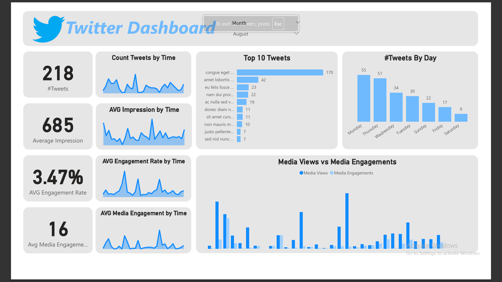

# 🐦 Twitter Analytics Dashboard

> An end-to-end Twitter analytics project analyzing tweet performance, engagement trends, and media impact across 1,166 tweets from June–October 2020.



---

## 🔍 Project Overview

This project analyzes a Twitter account's activity data to uncover patterns in tweet engagement, optimal posting times, top-performing content, and media effectiveness. The goal is to help social media teams make data-driven decisions to grow reach and improve engagement.

---

## 📁 Repository Structure

```
twitter-analytics/
│
├── SocialMedia.csv                   # Raw dataset (1,166 tweets, 21 features)
├── Twitter_Analytics_Dashboard.xlsx  # Excel dashboard with charts & KPIs
├── Twitter_Analytics_Report.docx     # Full written analysis report
├── Twitter_Analytics_Slides.pptx     # Executive presentation (8 slides)
├── dashboard_preview.png             # Power BI dashboard screenshot
└── README.md                         # Project documentation
```

---

## 📌 Key Findings

| Metric | Value |
|--------|-------|
| Total Tweets (dataset) | 1,166 |
| Tweets in August | **218** |
| Average Impressions | **782** |
| AVG Engagement Rate | **3.64%** |
| Avg Media Engagements | **53** |
| Best Posting Day | **Tuesday** (239 tweets) |
| Peak Posting Hour | **5 PM** (120 tweets) |

### Top Insights
- 📅 **Tuesday & Thursday** are the highest-volume posting days
- ⏰ **5 PM is peak activity hour** — best time to post for visibility
- 🏆 **Top tweet reached 54,098 engagements** — massively outperforming the average
- 📹 **July had highest media engagement** (avg 163 per tweet) vs other months
- 📉 **October shows lowest impressions** (554 avg) — audience reach declining
- 📊 **Engagement rate is consistent** at ~3.5–4% across all months

---

## 🛠️ Tools Used

| Tool | Purpose |
|------|---------|
| Microsoft Power BI | Interactive dashboard with filters & charts |
| Microsoft Excel | Supporting dashboard with charts |
| Python (pandas) | Data cleaning & exploration |

---

## 📊 Dashboard Features

The Power BI dashboard includes:
- **KPI Cards**: Total tweets, avg impressions, avg engagement rate, avg media engagements
- **Month Filter**: Slice all visuals by month
- **Line Charts**: Tweet count, impressions, engagement rate, and media engagement over time
- **Top 10 Tweets**: Ranked by engagement count
- **Tweets by Day**: Bar chart showing posting frequency per weekday
- **Media Views vs Engagements**: Combined bar chart showing media performance

---

## 🚀 How to Use

1. Clone the repository:
   ```bash
   git clone https://github.com/yourusername/twitter-analytics.git
   ```
2. Open `SocialMedia.csv` in Excel or Python for raw data exploration
3. Open `Twitter_Analytics_Dashboard.pdf` for the interactive Excel dashboard
4. Read `Twitter_Analytics_Report.docx` for the full written analysis

---

## 👤 Author

**[Your Name]**  
Data Analyst | Power BI • Excel • Python 
[LinkedIn](https://linkedin.com/in/youssefmohammedsoliman) 

---

## 📄 License

This project uses a publicly available social media analytics dataset for educational and portfolio purposes.
